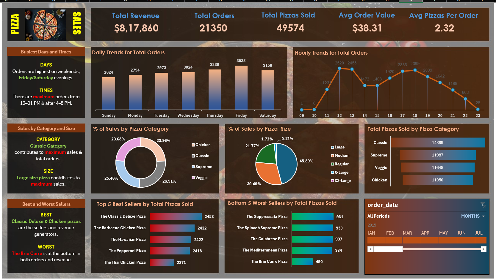
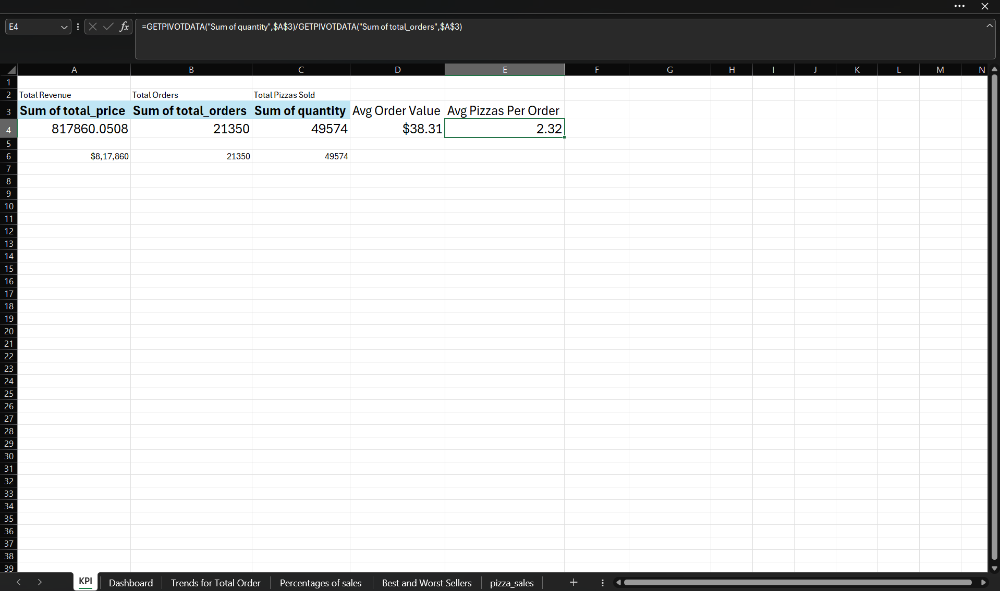

# 🍕 Pizza Sales Dashboard

---

# 📌 Project Overview

This project is an interactive Pizza Sales Dashboard built in Microsoft Excel to analyze pizza sales performance, customer ordering behavior, revenue trends, and business insights.

The dashboard transforms raw sales data into meaningful insights using Pivot Tables, Charts, KPI Cards, and Slicers.

---

# 🎯 Business Objective

The objective of this dashboard is to help businesses understand:

- Overall Sales Performance
- Total Revenue
- Total Orders
- Average Order Value
- Best Selling Pizzas
- Worst Selling Pizzas
- Sales Trends
- Category-wise Sales Distribution

---

# 🛠 Tools Used

- Microsoft Excel
- Pivot Tables
- Pivot Charts
- KPI Cards
- Slicers
- Conditional Formatting

---

# 📊 Dashboard Preview

---

# 📈 KPI Dashboard

---

# 🏆 Best & Worst Sellers

---

# 📊 Sales Distribution

---

# 📈 Order Trends

---

# 📂 Project Files

This repository contains:

- Pizza Sales Dashboard (.xlsx)
- Raw Dataset (.csv)
- SQL Practice Queries (.docx)
- Dashboard Screenshots

---

# 💡 Key Insights

- Identified peak sales periods
- Best and worst selling pizzas
- Revenue contribution by pizza category
- Overall sales trends
- KPI analysis for business decisions

---

# ⭐ If you like this project, don't forget to Star this repository!
